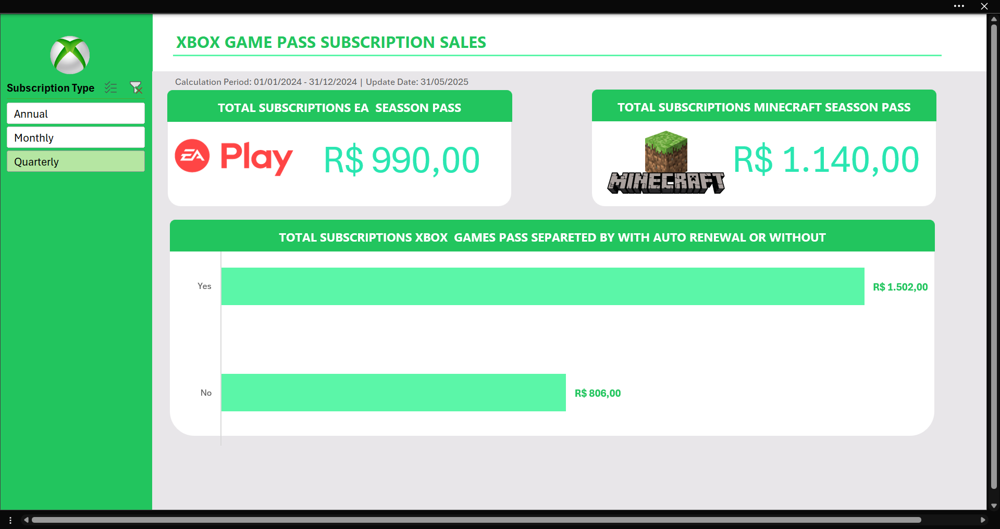

# 📊 Dashboard de Vendas - Xbox Game Pass

Este projeto foi desenvolvido como desafio final do curso de **Excel com Inteligência Artificial**. O objetivo principal foi criar um **dashboard interativo e visualmente informativo** para analisar os dados de assinaturas do Xbox Game Pass.

## 🧠 Objetivo do Projeto

Transformar dados brutos em **informações visuais claras e úceis**, permitindo:

* Acompanhar o desempenho de vendas de assinaturas.
* Facilitar a tomada de decisões com base em dados.
* Praticar habilidades em Excel e construção de dashboards.

## 🖼️ Visual do Dashboard



### Funcionalidades:

* Visualização das receitas totais com **EA Play** e **Minecraft**.
* Análise de assinaturas do **Xbox Game Pass com e sem renovação automática**.
* Filtro lateral para visualização por tipo de assinatura: **Anual, Mensal ou Trimestral**.
* Interface organizada, com elementos visuais intuitivos e cores que facilitam a leitura.

## 📂 Estrutura do Repositório

```
📁 Dashboard-Vendas-Xbox
├── Dashboard_de_Vendas.xlsx      # Arquivo Excel com o dashboard completo
├── DashboardFinal.png            # Captura de tela do dashboard
└── README.md                     # Este arquivo
```

## 🧪 Como Reproduzir

1. Baixe o arquivo `Dashboard_de_Vendas.xlsx`.
2. Abra no Excel (preferencialmente versão 365 ou superior).
3. Explore o dashboard e use os filtros disponíveis para personalizar a visualização dos dados.

## 📌 Tecnologias Utilizadas

* Microsoft Excel
* Gráficos e Segmentações
* Design de painéis de controle
* Filtros dinâmicos e formatação condicional

## ✅ Conclusão

Este projeto reforçou a importância da visualização de dados para análise de desempenho. A construção do dashboard foi feita com foco em clareza, usabilidade e estética.

---

💡 **Dica**: Clique nos filtros laterais para ver a performance por tipo de assinatura!

## 📬 Contato

Caso queira saber mais ou entrar em contato:

[🔗 GitHub](https://github.com/FranciscoGoyaAMC)
